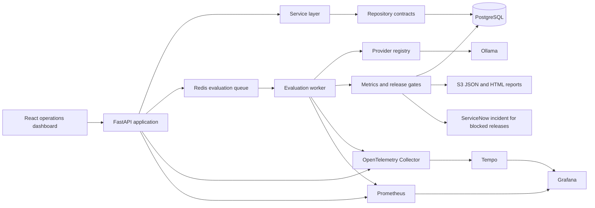
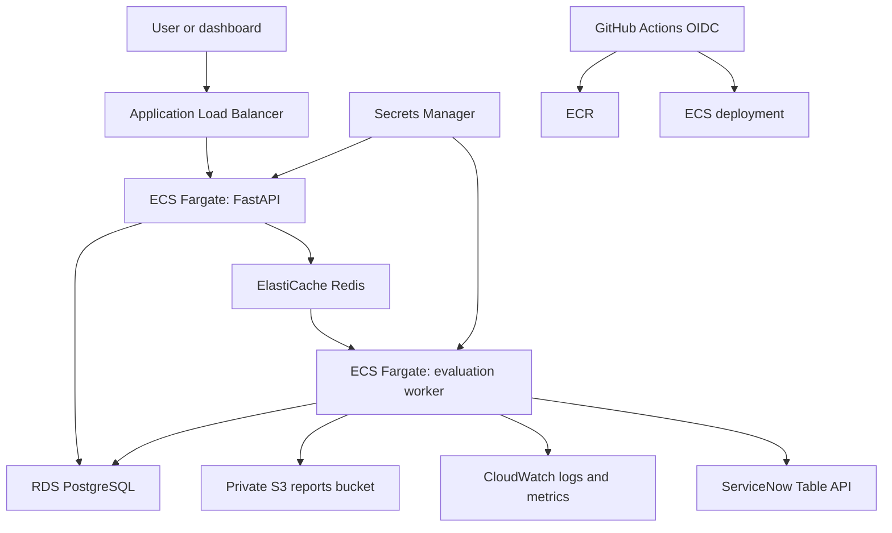
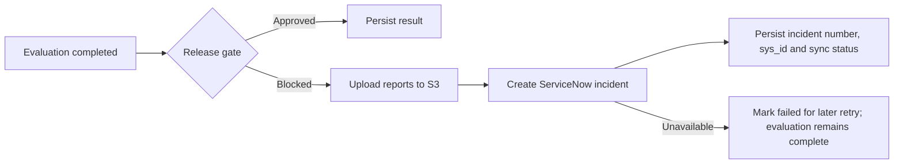

# FrontierOps

FrontierOps is an AI evaluation, deployment, and observability control plane for LLM-powered applications. It models the platform an enterprise AI team uses to register applications, test prompts against curated datasets, enforce release gates, compare versions, and investigate production signals before deployment.

This is an engineering platform, not a chatbot.

## Capabilities

- AI application registry with provider, model, prompt, dataset, and deployment state
- Provider abstraction with a production Ollama adapter
- Deterministic answer relevance, keyword coverage, and hallucination heuristics
- Asynchronous Redis-backed evaluation jobs and worker processing
- Quality, latency, failure-rate, and cost release gates
- Immutable prompt versions with activation, comparison, and regression detection
- Filterable evaluation history with persisted case-level results
- React and TypeScript operational dashboard
- OpenTelemetry traces, Prometheus metrics, Tempo, and provisioned Grafana dashboards
- Docker Compose development environment and GitHub Actions release validation
- AWS Fargate deployment with S3 reports, CloudWatch metrics, and ServiceNow incidents

## Architecture



Routes contain transport concerns only. Services implement use cases, repositories isolate persistence, providers isolate model vendors, and the evaluation package owns scoring and release decisions. See [Architecture](docs/ARCHITECTURE.md) for the detailed boundaries.

## Start locally

Prerequisites: Docker Desktop and Docker Compose.

```bash
cp .env.example .env
docker compose --profile ai up --build
```

The migration container upgrades PostgreSQL before the API and worker start.

| Surface | Address |
|---|---|
| FrontierOps dashboard | http://localhost:3001 |
| API documentation | http://localhost:8000/docs |
| API health | http://localhost:8000/api/v1/health/ready |
| Grafana | http://localhost:3000 |
| Prometheus | http://localhost:9090 |
| Tempo | http://localhost:3200 |
| Ollama | http://localhost:11434 |
| LocalStack S3 | http://localhost:4566 |

Pull a local model before running evaluations:

```bash
docker compose exec ollama ollama pull llama3.2:3b
```

Create a dataset through the API documentation, then use the dashboard to register an application and attach that dataset. Evaluations are queued through Redis and processed by the worker.

## Development checks

Python 3.12 and Node.js 22.13 or newer are required for host-based development.

```bash
python -m pip install -e "./backend[dev]"
cd frontend && npm ci && cd ..
make lint typecheck test frontend-check gate
```

The CI evaluation gate uses frozen responses and the same scorer and release-gate implementation as runtime evaluations. It exits non-zero when quality, latency, failure rate, or cost violates policy and uploads a JSON report.

## Deployment

See [Deployment guide](docs/DEPLOYMENT.md) for configuration, migrations, health probes, scaling, and rollback. See [Security](SECURITY.md) before exposing FrontierOps beyond a trusted development network.

### AWS architecture



Terraform provisions the VPC, two availability zones, ALB, ECS service, worker, encrypted RDS and Redis, private versioned S3 storage, ECR, CloudWatch, Secrets Manager, autoscaling, and least-privilege task roles.

```bash
cd infra/terraform
terraform init -backend-config="bucket=YOUR_STATE_BUCKET" -backend-config="key=frontierops/production.tfstate"
terraform plan -var="container_image=ACCOUNT.dkr.ecr.REGION.amazonaws.com/frontierops:SHA"
terraform apply
```

Populate the emitted ServiceNow secret with `instance_url`, `username`, and `password`, then apply with `-var=servicenow_enabled=true`. GitHub deployment requires repository variables for the OIDC role, region, state bucket, ECR repository, ECS cluster, and ECS service. It does not use AWS access keys.

### ServiceNow workflow



Blocked incidents contain application, prompt, model, quality, latency, failure rate, cost, gate failures, run ID, timestamp, and the report link.

### Environment variables

ServiceNow accepts the required unprefixed names: `SERVICENOW_ENABLED`, `SERVICENOW_INSTANCE_URL`, `SERVICENOW_USERNAME`, `SERVICENOW_PASSWORD`, and `SERVICENOW_INCIDENT_TABLE`. AWS report and metrics settings use `FRONTIEROPS_AWS_REGION`, `FRONTIEROPS_S3_REPORTS_BUCKET`, `FRONTIEROPS_S3_ENDPOINT_URL`, `FRONTIEROPS_CLOUDWATCH_METRICS_ENABLED`, and `FRONTIEROPS_CLOUDWATCH_NAMESPACE`.

### Demo scenario

1. Start Compose and create an application with a deliberately high minimum quality score.
2. Run an evaluation whose answer misses required keywords.
3. Confirm the release is `BLOCKED`, both reports exist in LocalStack S3, and the response contains ServiceNow synchronization fields.
4. Set `SERVICENOW_ENABLED=true` with a test instance to demonstrate real incident creation.

Screenshots to capture for a portfolio walkthrough: dashboard application list, blocked evaluation detail, S3 report, ServiceNow incident, CloudWatch metrics, and the GitHub deployment run.

### Security and cost controls

Resources are private by default, S3 public access is blocked, storage is encrypted, tasks run with scoped IAM roles, credentials live in Secrets Manager, ECR scanning is enabled, and the ALB should use an ACM certificate. Restrict ingress CIDRs and CORS before production use. Cost defaults use small RDS/Redis instances, lifecycle-expire old reports and images, and keep CloudWatch logs for 30 days. Production enables Multi-AZ RDS and therefore costs more; NAT Gateway, ALB, and observability ingestion are the main fixed costs.

## Project status

The cloud and ServiceNow extension is implemented in the working tree. AWS deployment is not claimed until account-specific variables, remote state, ServiceNow credentials, DNS/TLS, and budget controls are configured by the operator.
