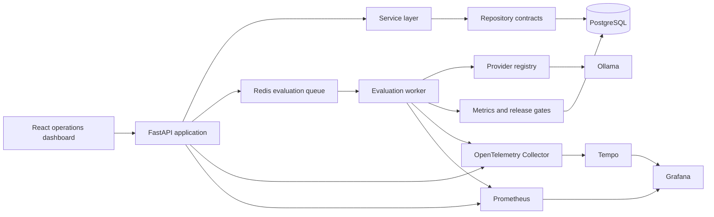

# FrontierOps

FrontierOps is an AI evaluation, deployment, and observability control plane for LLM-powered applications. It models the platform an enterprise AI team uses to register applications, test prompts against curated datasets, enforce release gates, compare versions, and investigate production signals before deployment.

This is an engineering platform, not a chatbot.

## Capabilities

- AI application registry with provider, model, prompt, dataset, and deployment state
- Provider abstraction with a production Ollama adapter
- Deterministic answer relevance, keyword coverage, and hallucination heuristics
- Asynchronous Redis-backed evaluation jobs and worker processing
- Quality, latency, failure-rate, and cost release gates
- Immutable prompt versions with activation, comparison, and regression detection
- Filterable evaluation history with persisted case-level results
- React and TypeScript operational dashboard
- OpenTelemetry traces, Prometheus metrics, Tempo, and provisioned Grafana dashboards
- Docker Compose development environment and GitHub Actions release validation

## Architecture



Routes contain transport concerns only. Services implement use cases, repositories isolate persistence, providers isolate model vendors, and the evaluation package owns scoring and release decisions. See [Architecture](docs/ARCHITECTURE.md) for the detailed boundaries.

## Start locally

Prerequisites: Docker Desktop and Docker Compose.

```bash
cp .env.example .env
docker compose --profile ai up --build
```

The migration container upgrades PostgreSQL before the API and worker start.

| Surface | Address |
|---|---|
| FrontierOps dashboard | http://localhost:3001 |
| API documentation | http://localhost:8000/docs |
| API health | http://localhost:8000/api/v1/health/ready |
| Grafana | http://localhost:3000 |
| Prometheus | http://localhost:9090 |
| Tempo | http://localhost:3200 |
| Ollama | http://localhost:11434 |

Pull a local model before running evaluations:

```bash
docker compose exec ollama ollama pull llama3.2:3b
```

Create a dataset through the API documentation, then use the dashboard to register an application and attach that dataset. Evaluations are queued through Redis and processed by the worker.

## Development checks

Python 3.12 and Node.js 22.13 or newer are required for host-based development.

```bash
python -m pip install -e "./backend[dev]"
cd frontend && npm ci && cd ..
make lint typecheck test frontend-check gate
```

The CI evaluation gate uses frozen responses and the same scorer and release-gate implementation as runtime evaluations. It exits non-zero when quality, latency, failure rate, or cost violates policy and uploads a JSON report.

## Deployment

See [Deployment guide](docs/DEPLOYMENT.md) for configuration, migrations, health probes, scaling, and rollback. See [Security](SECURITY.md) before exposing FrontierOps beyond a trusted development network.

## Project status

Version 1.0.0 implements the complete portfolio scope: registration, datasets, evaluations, releases, prompt comparison, history, dashboard, observability, containers, and enforced CI gates.
